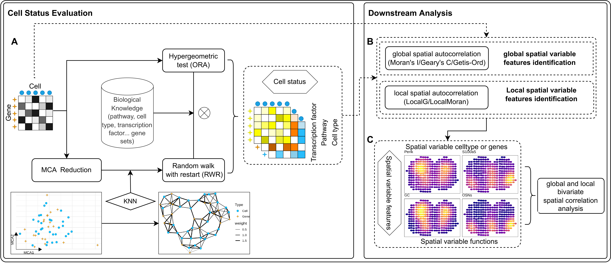

```{r, include = FALSE}
knitr::opts_chunk$set(
  collapse = TRUE,
  comment = "#>"
)
```

```{r, echo = FALSE, results="hide", message=FALSE, loadpkgs}
{library(SingleCellExperiment)
library(SpatialExperiment)
library(ggsc)
library(scuttle)
library(scran)
library(SVP)
library(ggplot2)
library(magrittr)
} |> suppressPackageStartupMessages()
```

# Introduction
 
Understanding the spatial distribution and interplay of cell states in tissue is critical for elucidating tissue formation and function. Single-cell and spatial omics present a promising approach to addressing this need. Traditional methods typically include the identification of highly variable genes, dimensionality reduction, clustering, and the annotation of cells or functions based on gene over-expression. Nevertheless, these qualitative approaches are inadequate for accurately mapping the distributions of spatial features. To address this, integrating biomedical knowledge such as Gene Ontology, KEGG, Reactome, transcription factors, and cell-type marker genes directly allows for the evaluation of cell states from gene expression data, creating quantitative functional pathway profiles at the single captured location.

After quantifying cell functions, analyzing their spatial distribution and co-distribution with other features can provide deeper insights into related biological questions. We focus on three aspects: the spatial variability of cell functions, regions where these functions cluster, and their co-distribution patterns with other features. Although existing tools such as `SPARK-X`[@SPARKX], `nnSVG`[@nnSVG], `SpatialDE`[@SpatialDE], `SpaGFT`[@SpaGFT], `Seurat`[@Seurat], and `Squidpy`[@Squidpy] facilitate the exploration of spatially variable genes, they are primarily designed for gene-level analysis and lack the capability to investigate the spatial co-distribution of features. Additionally, many of these tools, including `SpatialDE`[@SpatialDE], `SPARK`[@SPARK], `MERINGUE`[@MERINGUE], and `nnSVG`[@nnSVG], face challenges in handling large-scale spatial transcriptome data due to high memory consumption and low computational efficiency. 

To fill the gaps, we developed `SVP` to accurately predict cell states, explore their spatial distribution, and assess their spatial relationship with other features. 

# Overview of SVP

The evaluation of functional status at individual locations captured by SVP is achieved using Multiple Correspondence Analysis (`MCA`) for dimensionality reduction. This process employs a standardized gene expression matrix to project both cells and genes into a unified `MCA` space. It has been established that this method allows for the calculation of distances not only between genes and cells but also between cells and genes, thereby facilitating the assessment of their associations[@CelliD]. Proximity in this space indicates a stronger relationship. These calculated distances are crucial for constructing a weighted k-nearest neighbors (KNN) network, linking each cell or gene to its most relevant counterparts. To discern features with varying levels of proximity, distances are first normalized to a 0-1 scale, with closer distances approaching 1 and farther distances approaching 0. This normalization is followed by division by the total distance among the nearest features, thereby assigning greater connection weights to closer features. Subsequently, databases of known biological knowledge, such as transcription factor target gene sets, Reactome functional gene sets, and cell-type marker gene sets, serve as initial seeds. Random walks on the constructed weighted KNN network yield preliminary functional state activity scores for each location. To mitigate potential biases introduced by dimensionality reduction, a hypergeometric distribution test enhances the enrichment analysis of top-ranking genes extracted directly from the expression matrix at each location. These analyses provide weights for functional activities, culminating in the derivation of functional activity scores at the single captured location (Fig. 1A).

To identify spatially variable cell functions, we first established a cell neighbor weight matrix based on spot locations using the Delaunay triangulation (default) or KNN algorithm. This weight matrix, alongside global autocorrelation analyses such as Moran’s *I* (default), Geary’s *C*, or Getis-Ord’s *G*, facilitated the identification of spatially variable cell functions or gene characteristics. Additionally, we utilized the same cell neighbor weight matrix and local spatial autocorrelation algorithms (Local Getis-Ord or Local Moran) to delineate the local spatial distribution of these variable features (Fig. 1B). To examine spatial co-distribution among cell functions, we designed a bivariate spatial global and local autocorrelation algorithm employing the Lee index. This approach enables the assessment of correlation between different cell characteristics in their spatial distribution (Fig. 1C).

```{r echo=FALSE, fig.width = 12, dpi=400, fig.align="center", fig.cap= "Overview of SVP.", overview}
 
```

# Quantification of cell states using SVP

SVP can integrate gene or protein lists from existing biomedical databases like cell-type markers (PanglaoDB, CellMarkers), gene ontology (GO), molecular features (MSigDB), and pathways (KEGG, Reactome, Wikipathways), transcription factors, and disease ontology, to assess cell states. Of course, the cell-type markers also can be extracted from reference single cell data. In this vignette, we use the spatial transcriptome and single cell transcriptome of a human pancreatic ductal adenocarcinomas from the article[@PDAC] to demonstrate. Here, we first perform the normalization by `logNormCounts` of `scuttle` and the `MCA` dimensionality reduction by `runMCA` of `SVP`.

```{r, runMCA_spe}
# load the packages required in the vignette
library(SpatialExperiment)
library(SingleCellExperiment)
library(scuttle)
library(SVP)
library(ggsc)
library(ggplot2)
library(magrittr)

# load the spatial transcriptome, it is a SpatialExperiment object
# to build the object, you can refer to the SpatialExperiment package
data(pdac_a_spe)
pdac_a_spe 
# we had removed the genes that did not express in any captured location.
# First, we use logNormCounts of scuttle to normalize the spatial transcriptome
pdac_a_spe <- logNormCounts(pdac_a_spe)
# Now the normalized counts was added to the assays of pdac_a_spe as `logcounts`
# it can be extracted via logcounts(pdac_a_spe) or assay(pdac_a_spe, 'logcounts')

# Next, we use `runMCA` of `SVP` to preform the MCA dimensionality reduction
pdac_a_spe <- runMCA(pdac_a_spe, assay.type = 'logcounts')
# The MCA result was added to the reducedDims, it can be extracted by reducedDim(pdac_a_spe, 'MCA')
# more information can refer to SingleCellExperiment package
pdac_a_spe
```

## Quantification of CancerSEA etc function

SVP accepts `SingleCellExperiment` or `SpatialExperiment` object as input. The gene set should be a named list object, and the elements of the list must be included in the row names of the `SingleCellExperiment` or `SpatialExperiment` object. To quantifying the CancerSEA or other function for each captured location, the command `runSGSA` is used.

```{r, fig.width = 11, fig.height = 9.5, fig.align = 'center', fig.cap="The heatmap of each CancerSEA function", CancerSEA}
# This is gene list of Cancer Single-cell State Atlas to comprehensively decode distinct 
# functional states of cancer cells at single cell resolution.
data(CancerSEASymbol)

# It contains 14 types of cancer single-cell state, you can obtain 
# more information via ?CancerSEASymbol
names(CancerSEASymbol)

pdac_a_spe <- runSGSA(pdac_a_spe, 
                      gset.idx.list = CancerSEASymbol, # The target gene set list
                      assay.type = 'logcounts', # The name of assays of gene profiler
                      gsvaExp.name = 'CancerSEA' # The name of result to save to gsvaExps slot
		      )

# Then the result was added to gsvaExps to return a SVPExperiment object, the result
# can be extracted with gsvaExp, you can view more information via help(gsvaExp).
pdac_a_spe

gsvaExpNames(pdac_a_spe)

# The result is also a SingleCellExperiment or SpatialExperiment.
gsvaExp(pdac_a_spe, 'CancerSEA')

# We use sc_spatial of ggsc to visualize the distribution of each functions
# Note: when the number of features is too large, we reco
gsvaExp(pdac_a_spe, 'CancerSEA') %>% 
  sc_spatial(
    features = rownames(.),
    mapping = aes(x = x, y = y),
    geom = geom_bgpoint,
    pointsize = 1.2,
    ncol = 4,
    common.legend = FALSE # The output is a patchwork 
  ) & 
  scale_color_viridis_c(option='B', guide='none')

# The other function also can be quantified with runSGSA
# the gset.idx.list supports the named gene list, gson object or
# locate gmt file or html url of gmt.
pdac_a_spe <- runSGSA(
    pdac_a_spe, 
    gset.idx.list = "https://data.broadinstitute.org/gsea-msigdb/msigdb/release/2023.2.Hs/h.all.v2023.2.Hs.symbols.gmt",
    gsvaExp.name = 'hallmark',
    assay.type = 'logcounts' # default
)

# The result also was added to gsvaExps
pdac_a_spe 
```

## Quantification of cell-type

To quantifying the cell-type for each captured location, the gene set should be the marker gene sets of cell-type. It can be the pre-established marker gene sets, such as the markers from CellMarkers or PanglaoDB. High-quality cell marker genes from past reports or your own compilations are acceptable. In addition, It can also be extracted from the reference single cell data. The following sections will detail the specific operations of each approach.

### Quantification of cell-type using the pre-established marker gene sets

We can use the pre-established marker gene sets to quantifying the cell-type for each captured location. Here, we used the markers obtained from the `CARD`, which was used as input for `CARDfree` command.

```{r, fig.width = 9, fig.height = 7, fig.align = 'center', fig.cap='The pie plot of cell-type activity', runSGSA_free}
# The marker gene sets
load(url("https://github.com/YingMa0107/CARD/blob/master/data/markerList.RData?raw=true"))
markerList |> names()
# We can view the marker gene number of each cell-type.
lapply(markerList, length) |> unlist()

pdac_a_spe <- runSGSA(
                pdac_a_spe, 
                gset.idx.list = markerList,
                gsvaExp.name = 'CellTypeFree', 
                assay.type = 'logcounts'
              )

# Then we can visualize the cell-type activity via sc_spatial of SVP with pie plot
gsvaExp(pdac_a_spe, "CellTypeFree") |> 
   sc_spatial(
     features = sort(names(markerList)),
     mapping = aes(x = x, y = y),
     plot.pie = TRUE,
     color = NA,
     pie.radius.scale = .9
   )

```

We cal also display each cell-type activity with heat-map according to the spatial coordinate.

```{r, fig.align = 'center', fig.width = 11, fig.height=11, fig.cap = 'the heatmap of each cell-type activity', heatmap_celltype}
pdac_a_spe |> gsvaExp(3) |> 
   sc_spatial(
     features = sort(names(markerList)),
     mapping = aes(x = x,  y = y),
     geom = geom_bgpoint,
     pointsize = 1.2,
     ncol = 4
   ) +
   scale_color_viridis_c()
```

### Quantification of cell-type using the reference single-cell data

This approach requires obtaining the cell-type marker genes from the reference single-cell data. First, the reference single cell data should be normalized. Here, the command of `logNormCounts` of `scuttle` is used. Next, the `MCA` dimensionality reduction is performed by `runMCA` of `SVP`. Finally, the marker gene sets of cell-type are extracted via `runDetectMarker` of `SVP`. 

```{r, runDetectMarker}
# load the reference single cell transcriptome
# data(pdac_a_sce)
load("../data/pdac_a_sce.rda")
# it is a SingleCellExperiment
pdac_a_sce

pdac_a_sce <- logNormCounts(pdac_a_sce)

# obtain the top high variable genes
set.seed(123)
stats <- scran::modelGeneVar(pdac_a_sce)
hvgs <- scran::getTopHVGs(stats)

# perform the MCA reduction.
pdac_a_sce <- pdac_a_sce |> runMCA(assay.type = 'logcounts', subset.row=hvgs[seq(2000)])

# obtain the marker gene sets from reference single-cell transcriptome based on MCA space
refmakergene <- runDetectMarker(pdac_a_sce, group.by='Cell', ntop=200, present.prop.in.group=.2, present.prop.in.sample=.5)
refmakergene |> lapply(length) |> unlist()
```

Then, the quantification of the cell-type gene signatures can also be performed via `runSGSA` with the marker gene sets.

```{r, fig.width = 9, fig.height = 7, fig.align = 'center', fig.cap='The pie plot of cell-type activity with the marker gene sets from reference single-cell transcriptome', runSGSA_ref}
# use the maker gene from the reference single-cell transcriptome
pdac_a_spe <- runSGSA(
  pdac_a_spe,
  gset.idx.list = refmakergene,
  gsvaExp.name = 'CellTypeRef'
)

pdac_a_spe |> 
  gsvaExp('CellTypeRef') |> 
  sc_spatial(
    features = sort(names(refmakergene)), 
    mapping = aes(x = x, y = y),
    plot.pie = TRUE, 
    color = NA, 
    pie.radius.scale = .9
  )
```

We can found that the result based on marker gene sets from reference single-cell transcriptome is similar with the result based on marker gene sets from previous reports. 

# Spatial statistical analysis

SVP implements several spatial statistical algorithms to explore the spatial distribution of cell function or other features from three aspects: whether cell function states have spatial variability, where spatially variable cell functions cluster, and the co-distribution patterns of spatially variable cell functions with other features. The following sections provide a detailed description of each aspect.

## Univariate spatial statistical analysis 

This section addresses whether the feature is spatially variable and identifies its high-cluster areas. In detail, to identify the spatial variable features, `SVP` implements three spatial autocorrelation algorithms using `Rcpp` and `RcppParallel`: global Moran's *I*, Geary's *C* and Getis-Ord's *G*. To identify the spatial high-cluster areas, `SVP` implements two local univariate spatial statistical algorithms using `Rcpp` and `RcppParallel`: local Getis-Ord's *G* and local Moran's *I*.

### Identification of spatial variable features 

Here, we identify the spatial variable cell-types using `runDetectSVG`, which implements the global Moran's *I*, Geary's *C* and Getis-Ord's *G* algorithms.

```{r, runDetectSVG_I}

# First approach:
# we can first obtain the target gsvaExp with gsvaExp names via 
# gsvaExp() function, for example, CellTypeFree
pdac_a_spe |> gsvaExp("CellTypeFree") 

# Then we use runDetectSVG with method = 'moran' to identify the spatial variable 
# cell-types with global Moran's I.

celltype_free.I <- pdac_a_spe |> gsvaExp("CellTypeFree") |>
  runDetectSVG(
    assay.type = 'affi.score', # because default is 'logcounts', it should be adjused
    method = 'moransi',
    action = 'only'
  ) 
  
celltype_free.I |> dplyr::arrange(rank) |> head()

# Second approach:
# the result was added to the original object by specific the 
# gsvaexp argument in the runDetectSVG
pdac_a_spe <- pdac_a_spe |> 
  runDetectSVG(
    gsvaexp = 'CellTypeFree',  
    method = 'moran'
    )
gsvaExp(pdac_a_spe, 'CellTypeFree') |> svDf("sv.moransi") |> dplyr::arrange(rank) |> head()
```

The `obs` is the Moran's *I*, `expect.moransi` is the expect Moran's *I* (`E(I)`). Moran's *I* quantifies the correlation between a single feature at a specific spatial point or region and its neighboring points or regions. Global Moran’s *I* usually ranges from -1 to 1, Global Moran’s *I* significantly above `E(I)` indicate a distinct spatial pattern or spatial clustering, which occurs when neighboring captured locations tend to have similar feature value. Global Moran’s *I* around `E(I)` suggest random spatial expression, that is, absence of spatial pattern. Global Moran’s *I* significantly below `E(I)` imply a chessboard-like pattern or dispersion.

```{r, runDetectSVG_C}
# using Geary's C 
pdac_a_spe <- pdac_a_spe |>
  runDetectSVG(
    gsvaexp = 'CellTypeFree',
    method = 'geary'
  )

gsvaExp(pdac_a_spe, "CellTypeFree") |> svDf('sv.gearysc') |> dplyr::arrange(rank) |> head()
```

The `obs` is the Geary's *C*. Global Geary’s *C* is another popular index of global spatial autocorrelation, but focuses more on differences between neighboring values. Global Geary’s *C* usually range from 0 to 2. Global Geary’s *C* significantly below `E[C]=1` indicate a distinct spatial pattern or spatial clustering, the value significantly above `E[C]=1` suggest a chessboard-like pattern or dispersion, the value around `E[C]=1` imply absence of spatial pattern.

```{r, runDetectSVG_G}
# using Getis-ord's G
pdac_a_spe <- pdac_a_spe |>
  runDetectSVG(
    gsvaexp = 'CellTypeFree',
    method = 'getis'
  )

gsvaExp(pdac_a_spe, "CellTypeFree") |> svDf('sv.getisord') |> dplyr::arrange(rank) |> head()
```

The `obs` is the Getis-Ord's *G* of each cell-type. Global Getis-Ord's *G* measures global spatial autocorrelation by evaluating the clustering of high/low value, specifically identifying `hot spots` or `cold spots`. Global Getis-Ord's *G* values have no fixed range, as they depend on the specific dataset and spatial weight matrix. Global Getis-Ord’s *G* significantly above `E(G)` indicate a distinct spatial pattern or spatial clustering, which occurs when neighboring captured locations tend to have similar feature value. Global Getis-Ord’s *G* around `E(G)` suggest random spatial expression, that is, absence of spatial pattern. Global Getis-Ord's *G* significantly below `E(G)` imply a chessboard-like pattern or dispersion.

So the `Cancer clone A`, `Cancer clone B`, and `Acinar cells` were more concentrated in the spatial distribution compare to others.

### Identification of local spatial aggregation areas

Next, we can identify the spatial high-cluster areas for the spatial variable features via `runLISA`, which provides two local spatial statistics algorithms: Local Getis-Ord's *G* and Local Moran's *I*

```{r, runLISA_G}
celltypefree_lisares <- pdac_a_spe |> 
   gsvaExp("CellTypeFree") %>%
   runLISA(features=rownames(.), assay.type=1) 

celltypefree_lisares$Cancer_clone_A |> head()
```

Local Getis-Ord’s *G* (*G~i~*) measures the aggregation of a feature value in a specific spot and its neighbors, determining if locations are significantly clustered with high (hot spots) or low values (cold spots). *G~i~* usually have no fixed range, a larger *G~i~* indicates a stronger clustering of high expression for the feature in captured location and its neighboring spots, while a smaller *G~i~* indicates a stronger clustering of low expression.

```{r, fig.width = 9, fig.height = 3, fig.align = 'center', fig.cap="The result of local Getis-Ord for cell-type", LISA_G_fig}
gsvaExp(pdac_a_spe, 'CellTypeFree') |> 
  plot_lisa_feature(
    lisa.res = celltypefree_lisares[c('Cancer_clone_A', 'Cancer_clone_B', 'Acinar_cells')], 
    assay.type = 1, 
    gap_line_width = .18
  )

```

The highlighted area signifies that the feature is significantly clustered in this region.

We also can use local Moran's I method to identify the region.

```{r, runLISA_I}
celltypefree_lisa.i <- pdac_a_spe |>
   gsvaExp("CellTypeFree") %>%
   runLISA(
     features = rownames(.),
     assay.type = 1,
     method = 'localmoran'
   )

celltypefree_lisa.i$Cancer_clone_A |> head()
```

Local Moran’s *I* (*I~i~*) measures the spatial correlation between a feature's values in a specific area and its neighbors, assessing the similarity or difference between a location's value and those of its surroundings. *I~i~* also have no fixed range, a larger *I~i~* signifies a stronger positive correlation in a region and its neighbors, with clusters of high or low values. A smaller value indicates a negative correlation, where high values are next to low values, or vice versa.

```{r, fig.width = 9, fig.height = 3, fig.align = 'center', fig.cap='The result of local Moran for cell-type', LISA_I_fig}
gsvaExp(pdac_a_spe, "CellTypeFree") |>
  plot_lisa_feature(
     lisa.res = celltypefree_lisa.i[c('Cancer_clone_A', 'Cancer_clone_B', 'Acinar_cells')], 
     clustertype = 'High-High',
     assay.type = 1, 
     gap_line_width = .18
  )
```

## Bivariate spatial statistical analysis

Next, to explore the bivariate spatial co-distribution, `SVP` implements global and local bivariate spatial statistics algorithms. Global bivariate spatial statistics algorithm can be used to identify whether the bivariate is co-cluster in the specific space. Local bivariate spatial algorithm is to find the areas of spatial co-clustering of bivariate.

### Global bivariate spatial analysis 

Here, we use `runGLOBALBV` of `SVP` to explore the spatial co-distribution between the cell-types. 

```{r, runGLOBALBV}
gbv.res <- pdac_a_spe |> 
  gsvaExp('CellTypeFree') |> 
  runGLOBALBV(
    features1 = names(markerList),
    assay.type = 1, 
    permutation = NULL, # if permutation is NULL, mantel test will be used to calculated the pvalue
    add.pvalue = TRUE,
    alternative = 'greater' # one-side test 
  )
  
# gbv.res is a list contained Lee and pvalue matrix.
gbv.res |> as_tbl_df(diag=FALSE, flag.clust = TRUE) |> 
  dplyr::filter(grepl("Cancer", x)) |> dplyr::arrange(desc(Lee))
```

The `Lee` value typically ranges from -1 to 1. When the index is closer to 1, it indicates a strong positive spatial association between the two variables, meaning the high-value areas of one variable tend to overlap with the high-value areas of the other, and low-value areas similarly overlap, showing strong spatial consistency. Conversely, if the index is near -1, it suggests a strong negative spatial association, where the high-value areas of one variable tend to overlap with the low-value areas of the other.

We developed a function `plot_heatmap_globalbv` to visualize the result of global bivariate spatial analysis

```{r, fig.width = 7, fig.height = 5.5, fig.align = 'center', fig.cap="The results of clustering analysis of spatial distribution between cell-type", fig_gbv}
# We can also display the result of global univariate spatial analysis 
moran.res <- gsvaExp(pdac_a_spe, 'CellTypeFree') |> svDf("sv.moransi")

# The result of local univariate spatial analysis also can be added
lisa.f1.res <- gsvaExp(pdac_a_spe, "CellTypeFree", withColData = TRUE) |> 
    cal_lisa_f1(lisa.res = celltypefree_lisares, group.by = 'cluster_domain')

plot_heatmap_globalbv(gbv.res, moran.t=moran.res, lisa.t=lisa.f1.res)
```

We can explore the spatial co-cluster between the different type of `gsvaExp`. For example, we explore the spatial co-distribution between the `CellTypeFree` and `CancerSEA` of `pdac_a_spe` object.

```{r, fig.width = 6, fig.height=5.6, fig.align = 'center', fig.cap = "The heatmap of spatial correlation between cell tyep and CancerSEA states", runGLOBALBV_CellType_CancerSEA}
# If the number of features is excessive, we recommend selecting 
# those with spatial variability.
# celltypeid <- gsvaExp(pdac_a_spe, "CellTypeFree") |> svDf("sv.moransi") |> 
#   dplyr::filter(padj<=0.01) |> rownames()
celltypeid <- rownames(gsvaExp(pdac_a_spe, "CellTypeFree"))

cancerseaid <- gsvaExp(pdac_a_spe, "CancerSEA") |> 
   runDetectSVG(assay.type = 1, verbose=FALSE) |> 
   svDf() |> 
   dplyr::filter(padj <= 0.01) |>
   rownames()

runGLOBALBV(
  pdac_a_spe, 
  gsvaexp = c("CellTypeFree", "CancerSEA"), 
  gsvaexp.features = c(celltypeid, cancerseaid), 
  permutation = NULL, 
  add.pvalue = T
) -> res.gbv.celltype.cancersea

plot_heatmap_globalbv(res.gbv.celltype.cancersea)
```

### Local bivariate spatial analysis

After global bivariate spatial analysis, we found the `Cancer` cell and `Fibroblasts` show significant spatial co-aggregation. Next, we use `runLOCALBV` of `SVP` to identify the co-aggregation areas.

```{r, fig.width = 7, fig.height = 3.5, fig.align = "center", fig.cap='The heatmap of Local bivariate spatial analysis', runLOCALBV}
lbv.res <- pdac_a_spe |> 
  gsvaExp('CellTypeFree') |> 
  runLOCALBV(features1='Fibroblasts', features2=c('Cancer_clone_A', "Cancer_clone_B"), assay.type=1) 

# The result can be added to gsvaExp, then visualized by ggsc.
LISAsce(pdac_a_spe, lisa.res=lbv.res, gsvaexp.name='LBV.res') |> 
  gsvaExp("LBV.res") %>% 
  plot_lisa_feature(lisa.res = lbv.res, assay.type = 1)
```

The highlighted area denotes the region where the two variables significantly co-aggregate in space.

# Session information

Here is the output of `sessionInfo()` on the system on which this document was compiled:

```{r, echo=FALSE}
sessionInfo()
```

# References
